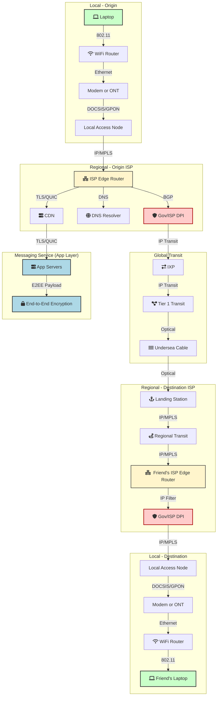

[category]: <> (General, Internet, Infrastructure)
[date]: <> (2025/10/24)
[title]: <> (The Journey of a Packet)

I've long held the suspicion that the internet is not as robust as many assume it is. There are countless books, articles, and thinkpieces on this topic so I am surely far from the fist person to hold this view, but I've hardly engaged with any of the critiques. My suspicion has lied mostly on the thought that it seems extremely unlikely that any of the core systems we use today were built to defend against the adversary models many of us see unfolding in the next few decades.

I won't divulge what I think these adversary models are here, but what I will do is walk through the journey of a packet from the network point of view to further understand our current infrastructure. What you should not expect is a masterful explanation of how the internet works, but the facts and resources I have learned along the way of undigging how the internet works. At the end I will opine on the classess of vulnerabilities, and whether satelite communication can help.

I also feel compelled to say that there are two other latent motivations for writing this document that have accelerated starting the journey out of total ignorance into less ignorance. The first is quite serious. A few weeks ago we saw the first [nation-wide shutdown of internet in Afghanistan](https://blog.cloudflare.com/nationwide-internet-shutdown-in-afghanistan/). The second, in numerous blockchain ecosystems, large amounts of research interest has increasingly flocked to the [study of distributed-systems-based consensus for guranteeing censorship resistance properties](https://arxiv.org/abs/2504.03588). If an adversary can easily censor at the underlying layers, then these efforts are somewhat futile, or at least over promising and under delivering.

---

## A Brief Nod to the Original Design
Straight from the design document, "[The Design Philosophy of the DARPA Internet Protocols](https://web.mit.edu/6.033/www/papers/darpa.pdf)” by David D. Clark posted in 1988 slightly retroactively to the adoption of the internert, which I didn't know existed until writing this post, "The fundemental goal for the DARPA internet architecture is to provide an effective technique for multiplexed utilization of existing interconnected networks." And due to the lack of definition for "effective", the design document lays out 7 secondary goals:

> 1. Internet communication must continue despite loss of networks or gateways.
> 2. The Internet must support multiple types of communications service.
> 3. The Internet architecture must accommodate a variety of networks.
> 4. The Internet architecture must permit distributed management of its resources.
> 5. The Internet architecture must be cost effective.
> 6. The Internet architecture must permit host attachment with a low level of effort.
> 7. The resources used in the Internet architecture must be accountable.

The interesting thing to note for me is that these "design requirements" should actually have relatively little impact on the ability to withstand different adversaries. This means it's very likely that the flaws I am concerned with are less about the initial assumptions, and more about implementations. But nonetheless, we continue on with the journey of a packet.

---

## The Journey of a Packet

How did the present-article-shaped bits on my laptop make their way to your screen? I am less interesetd in the specifics of where the bits are hosted and how they're interpretted, and more the rough shape of what networks they had to traverse to get from say one country to another.

### Background: The Internet as a "Network of Networks"

The very "inter" in "Internet" signifies that it is not a single entity, but a collection of independent networks connected together. Major tech companies, university campuses, and massive bandwidth providers each run their own network, technically known as an [**Autonomous System (AS)**](https://www.cloudflare.com/learning/network-layer/what-is-an-autonomous-system/). The number of routable ASNs is on the order of [~75–90k](https://www.cidr-report.org/as2.0/), depending on [how you count](https://blog.apnic.net/2021/03/19/how-do-we-count-asns/).

The protocol that governs the handoffs between these networks, including figuring out the best path across this global mesh, is the [**Border Gateway Protocol (BGP)**](https://www.cloudflare.com/learning/security/glossary/what-is-bgp/). As the [IETF RFC](https://datatracker.ietf.org/doc/html/rfc4271) describes it, BGP's primary function is to "exchange network reachability information with other BGP systems." This information essentially builds the map of the internet.

But are all Autonomous Systems the same? No, in practice, they form an unofficial hierarchy based on their scale and how they interconnect. This structure is built from a [few key components](https://en.wikipedia.org/wiki/Tier_1_network):

* **Points of Presence (PoPs):** These are the physical data centers where a network provider houses its routers and servers. A large provider might have hundreds of PoPs around the world, giving them a "presence" in major cities.
* **Internet Exchange Points (IXPs):** Think of an IXP as a neutral meeting ground. It's a large data center where hundreds of different networks bring their equipment to connect directly to one another. This direct connection, called **peering**, is often cheaper and faster than sending traffic through a paid provider.
* **Tier 2 and Tier 3 Networks:** These are most of the ISPs you know. They have their own regional or national networks but must pay larger networks to reach every corner of the global internet. This paid connection is called **transit**.
* **Tier 1 Networks:** At the very top are the **Tier 1 networks**. These are massive, globe-spanning backbones with such a comprehensive network that they typically don't buy transit from anyone. They can reach the entire internet through free peering agreements with all the other Tier 1 networks.

So to understand the traversal of a packet is to understand its journey through this hierarchy. A packet leaves your laptop, enters your local Tier 3 or Tier 2 ISP's AS, and is then guided by BGP routes, perhaps through an IXP or up to a Tier 1 provider for intercontinental transit, before resolving back down the hierarchy to finally reach your friend's laptop.

### A Side Note: The OSI Model

Network Engineering has a formal framework for conceptualizing the different layers of the journey called the **Open Systems Interconnection (OSI) Model**. The first formalized draft version of this model was proposed in 1980, stating it's goal:
>The universal need for interconnecting systems from different manufacturers rapidly became apparent, leading reation of subcommittee 16 with the objective to come up with standards required for "Open Systems Interconnection." The term "open" was chosen to emphasize the fact that by conforming to those international standards, a system will be open to all other systems obeying the same standards throughout the world.

[Today, the OSI model's practical purpose is](https://datageneral.co/osi-model/)
> a seven-layer framework developed by the ISO to standardize and explain how data travels through a network. These layers each have distinct roles, from physical transmission to end-user application communication, ensuring data is reliably transmitted and understood.

Your laptop talking to your router and the physical undersea cables we'll discuss later map to **Layer 1 (The Physical Layer)**, while the routing protocols like BGP and IP operate at **Layer 3 (The Network Layer)**. A full deep-dive is beyond the scope of this post, but understanding this layered structure is a valuable exercise for anyone thinking seriously about network architecture and its vulnerabilities. Check out [this resource](https://datageneral.co/osi-model/) to learn more.

### A Real-World Trace

With this layered model in mind, we can see the lower layers in action using a command-line tool called `traceroute`. It shows the hop-by-hop path a packet takes to its destination. Using a [python script](https://gist.github.com/dmarzzz/e3acfeb5a73fcb0f44ae38d8ecd04dab) to enrich the results, here is the path from my laptop at a cafe in Tokyo to `google.com`.

| Hop | IP | ASN | Holder | Role / Function | Notes |
| --- | --- | --- | --- | --- | --- |
| 1 | 10.19.163.254 |  |  | **Customer Gateway** | Your home or local router / access CPE. First hop into the ISP. |
| 2 | 150.249.207.1 | AS2527 | SO-NET Sony Network Communications Inc. | **Access / Regional Aggregation Router** | Local Sony/NURO access node in Tokyo (`tkyc` indicates Tokyo region). |
| 3 | 92.203.133.118 | AS2527 | SO-NET Sony Network Communications Inc. | **Aggregation / Metro Backbone** | Still Sony; consolidates traffic from multiple access routers. |
| 4 | 219.98.228.225 | AS2527 | SO-NET Sony Network Communications Inc. | **Backbone / Core Router** | Internal Sony backbone, likely between Tokyo PoPs. |
| 5 | 202.213.193.53 | AS2527 | SO-NET Sony Network Communications Inc. | **Backbone / Core Router** | Core link within Sony’s national network. |
| 6 | 202.213.193.85 | AS2527 | SO-NET Sony Network Communications Inc. | **Backbone / Core Router** | Redundant path in same core network block. |
| 7 | 202.213.193.53 | AS2527 | SO-NET Sony Network Communications Inc. | **Backbone / Core Router** | Duplicate of hop 5 — same core segment responding again. |
| 8 | 120.74.58.43 | AS2527 | SO-NET Sony Network Communications Inc. | **Backbone / Edge Transit** | Moving toward Sony’s edge routers that peer externally. |
| 9 | 219.98.234.43 | AS2527 | SO-NET Sony Network Communications Inc. | **Backbone / Edge Transit** | Alternate edge path within Sony backbone. |
| 10 | 120.74.58.43 | AS2527 | SO-NET Sony Network Communications Inc. | **Backbone / Edge Transit** | Same as hop 8, likely load-balanced reply. |
| 11 | 202.213.198.74 | AS2527 | SO-NET Sony Network Communications Inc. | **Peering Edge Router (IXP handoff)** | Sony’s peering edge handing traffic to Google — probably at JPNAP or BBIX Tokyo. |
| 12 | 216.239.59.33 | AS15169 | GOOGLE | **Google Ingress Router (Peering Edge)** | **First Google hop**, receiving traffic from Sony. |
| 13 | 172.253.66.203 | AS15169 | GOOGLE | **Google Core / Regional Backbone** | Inside Google’s Tokyo region network. |
| 14 | 108.170.235.121 | AS15169 | GOOGLE | **Google Internal Router** | Internal hop en route to service front-end. |
| 15 | 172.217.175.46 | AS15169 | GOOGLE | **Destination Server (Frontend)** | Google’s edge server responding to your request. |

As you can see, the packet spends its first 11 hops entirely within my ISP's network (**AS2527 - Sony**). At hop 12, the critical handoff occurs: the packet leaves Sony's network and enters Google's (**AS15169**), where it is routed internally to the destination server. This is a real-world example of peering between two Autonomous Systems.

As a side note, some may find it interesting how `traceroute` actually works. It works by exploiting the "TTL" (Time To Live) field in IP packets. "IP Packets" or "Internet Protocol Packets" are themselves defined in the "Darpa Internet Protocol" in [RFC-791](https://www.rfc-editor.org/rfc/rfc791.html). When this TTL reaches 0, a router will drop the packet and return an "ICMP Time Exceeded" message to the original IP. So `traceroute` "exploits" this feature by making requests and incrementing the "TTL" field such that each hop along the way it will return the IP of each host along the path of it's destination. 

### The Generalized Path

Building on that real-world trace, we can create a generalized model for how a packet travels from one continent to another. This theoretical path is illustrated in the diagram below and broken down into four key stages.

1.  **The Local Network**: It all starts when you hit 'send'. Your laptop sends the data packet over Wi-Fi (`802.11`) to your local router, which sends it through your modem ([ethernet](https://www.geeksforgeeks.org/computer-networks/ethernet-frame-format/)) to your ISP's local access node ([DOCSIS](https://www.netgear.com/images/pdf/DOCSIS31WhitePaper.pdf)/[GPON](https://www.cisco.com/c/en/us/support/docs/switches/catalyst-pon-series/216230-understand-gpon-technology.html)).
    - *Surprisingly the specification for `802.11` and `ethernet` are not as easy to get ahold of as you would expect.*

2.  **The Regional ISP**: Inside your ISP's network, your packet travels through aggregation and core routers. Here, a DNS query resolves the destination's IP address. This is a primary chokepoint where an ISP or government can deploy **Deep Packet Inspection (DPI)** tools.

3.  **The Global Backbone**: At the edge of its network, your ISP uses BGP to decide the best onward path. It exchanges traffic with other networks, either through direct connections or at an **Internet Exchange Point (IXP)**. For international traffic, the packet is handed to a **Tier 1** transit provider and sent across an undersea cable.

4.  **Arrival and Delivery**: After crossing the ocean, the packet lands and is handed off to the destination's local ISP. It traverses their regional network, potentially passing through another DPI checkpoint, and is finally delivered to the destination laptop.

<!-- end list -->

This entire journey, involving dozens of pieces of hardware across multiple administrative and national domains, happens in milliseconds. And as any good decentralization analysis teaches us, each step represents a potential point of failure or control.

-----

## Mapping the Vulnerabilities

For the rest of this post I will break down the points of failure into three different categories: the political, the logical, and the brutally physical.

  * There's the **political layer**, where a group of people (i.e. governement or rebellion etc) can simply order a handful of local ISPs to shut down, effectively unplugging a country from the world.
  * There's the **logical layer**, where the internet's own routing and naming protocols, built on decades-old assumptions of trust, can be manipulated to misdirect or spy on traffic.
  * And finally, there's the **physical layer**: the simple, tangible fact that our global data flows through a few hundred vulnerable cables resting on the ocean floor.

The following sections explore each of these threat vectors in detail.

-----

## The Political Layer: The Power of the Switch

In the abstract, this layer touches anything where a human in the loop can influence the availability, reliability, or privacy of the system. Typically this looks like the exercise of raw state power. Centralized authorities can leverage their legal and coercive control over the infrastructure within their borders to directly manipulate.

### The "Off Switch": Nationwide Shutdowns

The most blunt instrument of control is a complete network shutdown. We've seen this tactic deployed during protests and political unrest in numerous countries. A striking, large-scale example of this occurred on Monday, September 29, 2025, when Afghanistan experienced a near-total internet blackout. By compelling the handful of ISPs operating within the country to cease BGP announcements and shut down services, the authorities effectively severed the entire nation from the global internet, as detailed in [reports from network observers like Cloudflare](https://blog.cloudflare.com/nationwide-internet-shutdown-in-afghanistan/).

No matter how "global" we think the internet is, the "last mile" is almost always controlled by a small number of local providers who are subject to the laws of power.

### Surgical Strikes: Deep Packet Inspection (DPI)

While nationwide shutdowns are a blunt instrument, a far more subtle threat operates at this layer: **Deep Packet Inspection (DPI)**. While the tool itself is technical, but its power is political. It's a surveillance capability deployed by an authority, like a government compelling an ISP, to enforce policy on network traffic. It's suspected that DPI is one of many tools in the "[Great Firewall's Multi-layered Web Filtering Apparatus](https://www.usenix.org/publications/loginonline/measuring-great-firewall%E2%80%99s-multi-layered-web-filtering-apparatus)".

While E2EE protects your message's content, DPI allows network operators to inspect the metadata of your data packets. Even with modern encryption like TLS 1.3, the initial "handshake" to a website happens in the open. This exposes a critical piece of metadata: the **Server Name Indication (SNI)**, which reveals the name of the website you are connecting to.

Governments and ISPs can use the visibility of SNI and other metadata for a range of activities, from throttling specific types of traffic to outright blocking access to certain IPs or services.

  - **Legal Frameworks**: The U.S. [**Communications Assistance for Law Enforcement Act (CALEA)**](https://www.fcc.gov/calea) requires covered providers to maintain lawful intercept capability; it does not mandate application ‘backdoors.’ Content interception still requires legal process. Similarly, [Section 702 of the FISA Amendments Act](https://www.google.com/search?q=https://www.aclu.org/issues/national-security/privacy-and-surveillance/fisa-section-702) provides broad authority for surveillance.
  - **Surveillance Programs**: The [global surveillance disclosures of 2013](https://en.wikipedia.org/wiki/Global_surveillance_disclosures_\(2013%E2%80%93present\)) by Edward Snowden demonstrated that intelligence agencies engage in large-scale collection of internet metadata. Upstream collection on backbone links (e.g., via provider cooperation) was documented; this is DPI-adjacent even if not branded as such.

For a comprehensive report, check out the FTC's "[A Look At What ISPs Know About You: Examining the Privacy Practices of Six Major Internet Service Providers](https://www.ftc.gov/system/files/documents/reports/look-what-isps-know-about-you-examining-privacy-practices-six-major-internet-service-providers/p195402_isp_6b_staff_report.pdf)".

One ray of hope is [**Encrypted Client Hello (ECH)**](https://support.mozilla.org/en-US/kb/understand-encrypted-client-hello), a protocol designed fix SNI-like metadata leakage. ECH encrypts the first "hello" message, hiding your destination and making it much harder for network observers to track which sites you visit. Adoption is still very early.

-----

## The Logical Layer: Manipulating the Map

The vulnerabilities in this layer exist because its core protocols—especially BGP and DNS—were designed in the 1980s and 90s for a much smaller, more cooperative internet. They were fundamentally built on an assumption of trust that has long since broken down. They lack built-in mechanisms to cryptographically verify the information they receive.

This "trust-by-default" architecture means:

  * For **BGP**, when one Autonomous System announces a path to another, the protocol's default behavior is simply to believe it. It's like taking a stranger's word for directions without checking a map.
  * For **DNS**, the original system had no way to guarantee a response was authentic. When you ask for a website's IP address, you have to trust that the answer hasn't been forged by an attacker.

This assumption of cooperation, not hostility, is the central vulnerability of the logical layer. Adversaries can exploit this trust to manipulate the internet's own map, often invisibly to the end-user.

### BGP Hijacks & Route Leaks

The most common manifestation of this trust vulnerability is a **BGP hijack**, where an attacker falsely announces that they are the legitimate destination for traffic they don't own. The version of BGP used universally today, **BGPv4**, is the standard that contains this vulnerability; its design is what allows hijacks to occur.

The BGP system operates on a "trust-by-default" model, which is the opposite of a capability system. It is a world where anyone could walk up to any car and say, "The owner said I could borrow this," and you'd have to take their word for it. This is why BGP hijacks are so easy as there was no verifiable proof of authority for some time.

The modern security fix is not a new version of BGP, but a parallel system called **[Resource Public Key Infrastructure](https://en.wikipedia.org/wiki/Resource_Public_Key_Infrastructure) (RPKI)**. Think of it as adding a notarized deed to a land claim. Network owners can publish a cryptographically signed record called a **[Route Origin Authorization](https://www.arin.net/resources/manage/rpki/roa_request/) (ROA)**, which publicly declares, "My AS is the only one authorized to originate routes for this specific block of IP addresses."

This allows any network operator to automatically validate incoming BGP announcements, rejecting fraudulent ones that don't match the public ROA. It directly combats BGP hijacking by replacing blind trust with verifiable, cryptographic proof. While RPKI adoption is growing, it is not yet universal, leaving significant parts of the internet vulnerable.

### DNS Manipulation

Attackers can block access or redirect users by poisoning the cache of recursive DNS resolvers or taking over authoritative nameservers. **Mitigation**: [**DNSSEC**](https://www.google.com/search?q=https://www.cloudflare.com/learning/dns/dns-security/what-is-dnssec/) provides a similar cryptographic validation for DNS responses, while encrypted protocols like **DNS-over-HTTPS (DoH)** and **DNS-over-TLS (DoT)** protect the query itself from being snooped on or tampered with in transit.

### IXP & Peering Fabric Outages

Over-reliance on a single IXP or a small number of peering partners can create concentrated points of failure, leading to regional brownouts if they go down. In 2013, during the [Spamhaus DDoS incident](https://blog.cloudflare.com/the-ddos-that-almost-broke-the-internet/), attackers reportedly pivoted to targeting major IXP interconnects in an attempt to disrupt peering routes. Although the exchanges remained operational due to massive overcapacity and robust defenses, the incident highlighted their strategic importance as targets. **Mitigation**: **Multihoming** across multiple IXPs and transit carriers provides path diversity and resilience.

Data and monitoring of such events are available from sources like [RIPEstat](https://stat.ripe.net/), [CAIDA](https://www.caida.org/), [OONI](https://ooni.org/), and [Cloudflare Radar](https://radar.cloudflare.com/).

-----

## The Physical Layer: Brute Force Fragility

Beneath all the protocols and politics lies the physical reality of the internet: a network of tangible, vulnerable hardware. Active censorship is not required when the underlying infrastructure can be disrupted or destroyed.

### The Undersea Cable Weakness

Over 95% of all transcontinental data traffic travels through a few hundred [fiber-optic submarine cables](https://www.submarinecablemap.com/) laid across the ocean floor. This makes these cables incredibly high-value strategic assets and, simultaneously, highly vulnerable targets, as detailed in reports by organizations like [CSIS](https://www.csis.org/analysis/safeguarding-subsea-cables-protecting-cyber-infrastructure-amid-great-power-competition).

  - **Espionage and Sabotage**: State actors are acutely aware of this vulnerability. Russian naval assets, like the spy ship [*Yantar*](https://www.google.com/search?q=https://www.forbes.com/sites/hisutton/2021/08/21/how-russias-most-sinister-spy-ship-yantar-is-making-a-splash/), equipped with deep-sea submersibles, have been observed loitering near critical cable routes, raising alarms about potential tapping or cutting operations in a conflict scenario.
  - **Supply Chain Risks**: The maintenance of these cables presents another vector of risk. For instance, state-controlled companies repair cables owned by major U.S. tech firms. This creates opportunities for installing backdoors, mapping sensitive military communication links, or simply denying repairs during a geopolitical crisis.

The legal framework for protecting these cables in international waters is fragmented and weak, leaving the backbone of our global economy and communication system alarmingly exposed.

### Hardware Interdiction and Supply-Chain Exploitation

Beyond purely logical attacks, a more insidious class of threats targets the **hardware supply chain** itself. Intelligence agencies have historically exploited this layer to gain persistent access to target networks.

According to multiple investigative reports and leaked documents, the U.S. **NSA and CIA** conducted interdiction operations during the early 2010s — physically intercepting or modifying hardware in transit to install covert implants before devices reached their final destination. This practice is described in *The Guardian*’s analysis in Glenn Greenwald’s article, “[How the NSA tampers with US-made internet routers](https://www.theguardian.com/books/2014/may/12/glenn-greenwald-nsa-tampers-us-internet-routers-snowden)”. And it’s echoed in Amnesty International’s *[Two Years After Snowden](https://www.amnesty.nl/content/uploads/2015/06/two_years_after_snowden_final_report_en_a4.pdf)* report, which explicitly mentions “interdicting shipments of computer hardware … altering the hardware.” Some allege Edward Snowden himself discovered signs of such tampering on his own router hardware.

Quintus et al point towards a large design space of "[Zero Trust Supply Chains](https://writings.flashbots.net/ZTEE2-Supply-Chains)" aimed at mitigating these concerns with verifiable chip design, decentralized attestation services, and much more.

### Environmental and Natural Disruptions

Even without malicious intent, the **physical geography** of the internet creates fragility. Undersea and terrestrial fiber routes are routinely disrupted by **natural disasters**, from earthquakes off the coast of Taiwan — such as the [2006 Hengchun earthquake that severed multiple Asia-Pacific submarine cables](https://www.submarinenetworks.com/en/nv/news/cables-cut-after-taiwan-earthquake-2006) — to more recent events, e.g. in 2023 when [two undersea cables connecting Taiwan’s Matsu islands were cut, isolating local internet access](https://www.reuters.com/world/asia-pacific/taiwan-coast-guard-says-investigation-damaged-undersea-cable-stymied-by-weather-2025-01-07/).

*Submarine Cables Cut after Taiwan Earthquake in Dec 2006*

-----

## Is Satellite Internet the Answer? 🛰️

With terrestrial networks so vulnerable, it's natural to look to the skies. [Low-Earth Orbit (LEO) satellite constellations](https://en.wikipedia.org/wiki/Satellite_Internet_constellation) like [Starlink](https://www.starlink.com/) seem to offer a path to bypassing local chokepoints. If your local ISP is shut down, can't you just point a dish at a satellite?

Yes, but with major caveats. Satellite internet is a powerful tool for resilience and coverage, but it is not a replacement for the raw capacity of fiber. The physics are unforgiving.

The maximum throughput of a communication channel is described by the [**Shannon-Hartley theorem**](https://en.wikipedia.org/wiki/Shannon%E2%80%93Hartley_theorem):

$$ \text{Channel Capacity} = \text{bandwidth} \log_2(1 + \text{SNR}) $$

Where $\text{SNR}$ is the signal-to-noise ratio. So fiber will always win on raw throughput:

1.  **Bandwidth (B)**: A single fiber-optic cable can use hundreds of different light frequencies simultaneously, giving it access to terahertz of optical spectrum. A satellite is constrained by a comparatively tiny slice of licensed radio frequency (RF) spectrum.
2.  **Signal-to-Noise Ratio (SNR)**: A signal sent through space suffers from immense **Free-Space Path Loss (FSPL)**, which weakens it dramatically. Fiber optic cables regenerate the signal with amplifiers every \~80 km, keeping the SNR extremely high.

Think Mb/s–Gb/s per RF link vs Tb/s per fiber pair, a $10^3$–$10^6\times$ gap depending on what you compare (per-flow, per-beam, or aggregate). So satellites may become a crucial part of a resilient internet architecture, providing an alternative path when terrestrial routes fail. But they cannot carry the firehose of data that the global backbone requires. NASA is performing [tests to use point-to-point optical communication through the use of lasers](https://www.jpl.nasa.gov/news/nasas-laser-comms-demo-makes-deep-space-record-completes-first-phase/), but this will likely never replace our uplink from ground to a satelite.

-----

## Conclusion: The New Adversary Model

While I wont defend this statement vigorously, it does seem the "adversary model" at the base of the internet is not actually the issue. It is more so the implemenation of your connection into the internet, and how it connects to your destination which need a specification with a stronger adversary model. If we want to gurantee that 100% of the time that you try to reach country A through country B with low bandwidth messaging, then it likely needs many different physical paths to accept such traffic, as well as transmit it. The future may include a combination of multicasting to many different paths to avoid reliance on one, including the use of satelite communication and more. As a rule of thumb, we should likely look to principles for designing such infastructure which look something like:

* **The Local Network is Not Neutral.** The "last mile" ISP is not a simple, neutral pipe. We must assume it is a potential agent of control, subject to the legal and political pressures of its jurisdiction. Any packet entering or exiting a national border is subject to inspection, filtering, or complete blockage.
* **The Global Map is Malleable.** The internet's core routing protocols, like BGP and DNS, were built on a foundation of trust that no longer holds. We must assume that the path our data takes can be maliciously altered to reroute, monitor, or drop our traffic without our knowledge.
* **Physical Chokepoints are Targets.** The physical infrastructure of the internet is not an invulnerable, decentralized mesh. We must proactively assume that its most critical chokepoints, especially the handful of undersea cables connecting continents, are high-value targets that are unreliable in a geopolitical conflict.

For decades, we have focused on making the message unreadable. The next great challenge is to make the medium unstoppable. The level of pessimissm we have for the future should inform the architecture, but the optimism we have for humanity should guide it's undertaking.
